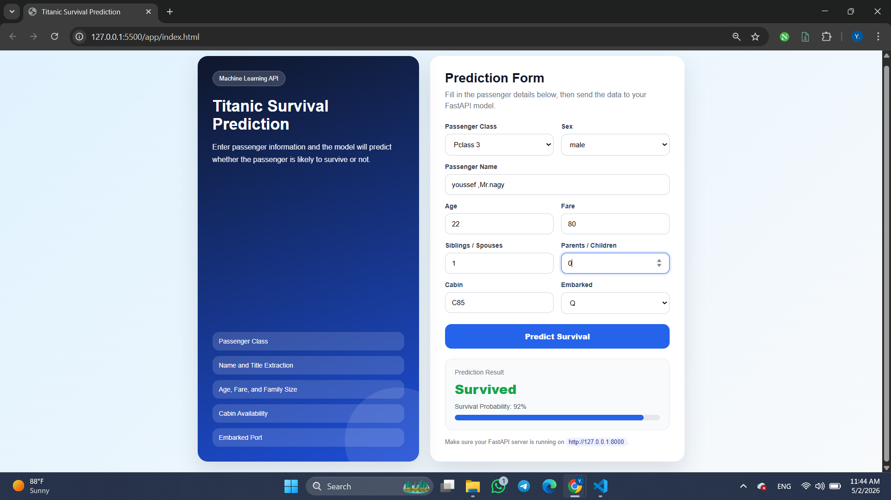
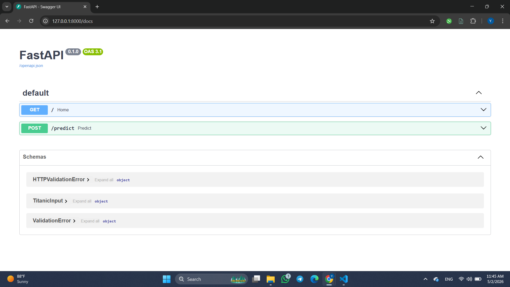

# Titanic Survival Prediction

This project uses machine learning to predict whether a Titanic passenger was likely to survive based on passenger information such as class, sex, age, fare, family size, cabin availability, and embarked port.

The project includes data analysis, preprocessing, feature engineering, model training, a saved machine learning model, a FastAPI backend, and a simple web interface.

## Project Overview

The goal of this project is to build a machine learning model that predicts Titanic passenger survival.

The model uses the following input features:

- Passenger Class
- Name
- Sex
- Age
- Number of Siblings or Spouses aboard
- Number of Parents or Children aboard
- Fare
- Cabin
- Embarked Port

The target variable is:

- Survived

This is a binary classification problem where the model predicts whether a passenger survived or did not survive.

## Screenshots

### Web Interface



### FastAPI Documentation



## Project Workflow

The notebook follows these steps:

1. Import required libraries
2. Load and inspect the dataset
3. Explore missing values and duplicated records
4. Perform exploratory data analysis
5. Clean and preprocess the dataset
6. Create feature engineering variables
7. Train machine learning models
8. Evaluate model performance
9. Save the trained model using Joblib
10. Use the saved model in a FastAPI application
11. Create a simple web interface to interact with the API

## Dataset

The dataset contains passenger information from the Titanic dataset.

Some important columns include:

- Pclass
- Name
- Sex
- Age
- SibSp
- Parch
- Fare
- Cabin
- Embarked
- Survived

The dataset includes both numerical and categorical features, and some columns contain missing values.

## Feature Engineering

Several new features were created to improve model performance and make the data more useful for prediction.

The main engineered features include:

- Title extracted from passenger names
- HasCabin to indicate whether a passenger had cabin information
- FamilySize based on SibSp and Parch
- IsAlone to identify passengers traveling alone
- LogFare to reduce skewness in the Fare column

These features help the model capture more meaningful patterns from the original dataset.

## Final Model

The final saved object contains:

- Trained machine learning model
- Scaler
- Final training columns

The model file was saved as:

```text
model.pkl
```

## FastAPI Application

The FastAPI backend loads the saved model and receives passenger information through a `/predict` endpoint.

The API returns:

- Prediction result
- Prediction code
- Survival probability

## Project Structure

```text
titanic-survival-prediction/
│
├── app/
│   ├── main.py
│   └── index.html
│
├── data/
│   └── Titanic-Dataset.csv
│
├── model/
│   └── model.pkl
│
├── notebook/
│   └── Titanic.ipynb
│
├── Img/
│   ├── frontend-preview.png
│   └── api-docs.png
│
├── requirements.txt
├── README.md
├── .gitignore
└── LICENSE
```

## How to Run the Project

### 1. Clone the repository

```bash
git clone https://github.com/Nagy-API/titanic-survival-prediction.git
cd titanic-survival-prediction
```

### 2. Install dependencies

```bash
pip install -r requirements.txt
```

### 3. Run the FastAPI server

From the main project folder, run:

```bash
uvicorn app.main:app --reload
```

The API will run at:

```text
http://127.0.0.1:8000
```

You can open the API documentation here:

```text
http://127.0.0.1:8000/docs
```

### 4. Open the web interface

Open this file in the browser:

```text
app/index.html
```

Then enter passenger information and click the prediction button.

## API Example

Example input:

```json
{
  "Pclass": 3,
  "Name": "Yousef, Mr. Nagy",
  "Sex": "male",
  "Age": 20,
  "SibSp": 1,
  "Parch": 0,
  "Fare": 2000,
  "Cabin": null,
  "Embarked": "S"
}
```

Example output:

```json
{
  "prediction": "Not Survived",
  "prediction_code": 0,
  "survival_probability": 0.4213
}
```

## Kaggle Notebook

The notebook version of this project is also available on Kaggle:

https://www.kaggle.com/code/mlnagy/titanic-survival-prediction

## Kaggle Dataset

The dataset version is available on Kaggle:

https://www.kaggle.com/datasets/mlnagy/titanic-survival-prediction-dataset

## Important Note

This project is mainly useful for demonstrating a complete machine learning workflow, including data analysis, preprocessing, feature engineering, model training, model saving, API deployment, and frontend integration.

## Technologies Used

- Python
- Pandas
- NumPy
- Scikit-learn
- Matplotlib
- Seaborn
- FastAPI
- HTML
- CSS
- JavaScript
